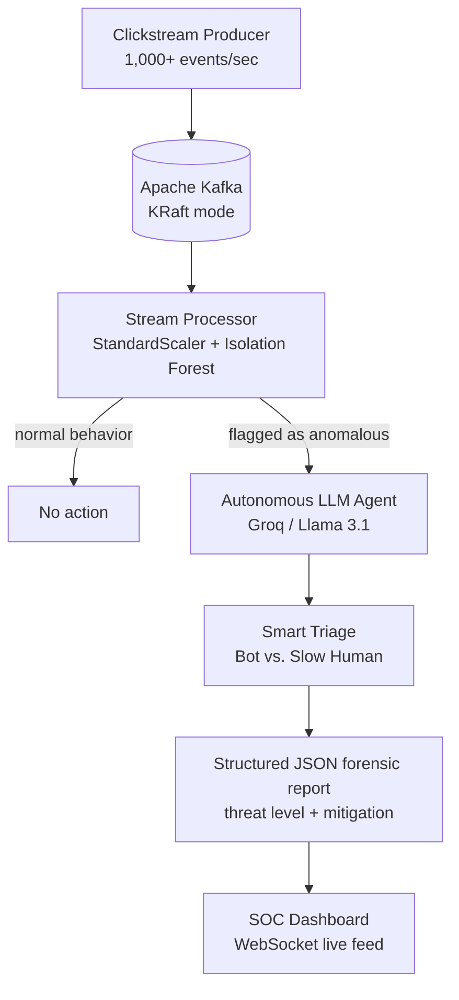
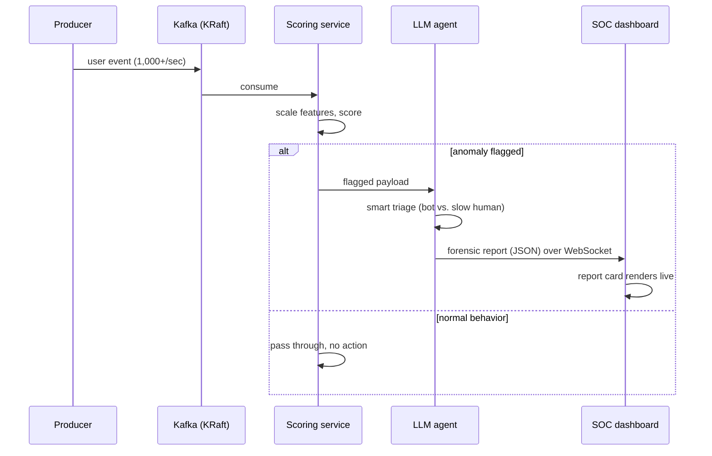

<div align="center">

# Anomaly Investigation Engine


> An event-driven streaming pipeline that scores live user behavior in milliseconds —
> and dispatches an autonomous AI investigator when something looks wrong.

</div>

<p align="center">
  
</p>

## Overview

The **Anomaly Investigation Engine** is an event-driven streaming pipeline that
monitors live user behavior to detect fraud, bots, and system glitches in
milliseconds.

Unlike traditional batch-processing models that analyze "yesterday's data,"
this system ingests live clickstream data via Apache Kafka, scores it using an
unsupervised machine learning model (Isolation Forest) in real time, and
triggers an **Autonomous LLM Agent** to investigate flagged anomalies, generate
forensic reports, and recommend mitigation actions.

The entire stack — Kafka, the ML scoring service, the AI agent, and the API —
spins up with a single `docker-compose up` command and runs locally.

## The Problem

Fraud detection systems usually fail on one of three axes: they are too slow,
they need labeled data that nobody has, or they detect without explaining. This
engine is built to fail on none of them.

| Approach | Detection speed | Training data | Triage |
| --- | --- | --- | --- |
| Batch analytics | Next day, at best | Historical warehouse | An analyst reads yesterday's alert list |
| Rules engine | Real time | Hand-written thresholds, constantly rotting | Fires on anything matching the rule, true or false |
| Supervised ML | Near real time | Labeled fraud examples — scarce, and stale the moment attackers adapt | A score with no story behind it |
| **This engine** | Milliseconds after the event | None — unsupervised, learns "normal" from the live stream | An LLM agent investigates each flag and returns a structured report |

By the time a batch job has run, the fraudulent session is already over.
Detection only matters if it happens while the event is still happening — and
judgment only matters if it arrives with the detection, not hours later. This
engine pairs the two: a fast statistical detector that never sleeps, and an AI
investigator that explains what it found.

## Key Features

| Feature | What it does |
| --- | --- |
| Real-time streaming | Simulates 1,000+ live user events per second using Apache Kafka (KRaft mode) |
| Unsupervised ML detection | Uses scikit-learn's Isolation Forest to profile user behavior and assign real-time anomaly scores without labeled data |
| Autonomous AI investigator | When an anomaly is flagged, an LLM agent (Groq / Llama 3.1) is triggered. It analyzes the payload, determines the threat level (Bot vs. Slow Human), and generates a structured JSON forensic report |
| Live SOC dashboard | A dark-themed, WebSocket-powered FastAPI frontend where AI forensic reports pop up in real time |
| Fully containerized | The entire stack (Kafka, ML model, AI agent, API) spins up with a single `docker-compose up` command |

## Quick Start

After completing [Setup and Installation](#setup-and-installation):

```bash
docker-compose up -d --build
```

Wait 2-3 minutes for the ML baseline to train, then open
`http://localhost:8000` and watch the forensic reports arrive live.

## Table of Contents

- [Overview](#overview)
- [The Problem](#the-problem)
- [Key Features](#key-features)
- [How It Works: The Detection Pipeline](#how-it-works-the-detection-pipeline)
- [Architecture](#architecture)
- [The AI Investigator](#the-ai-investigator)
- [Performance Envelope](#performance-envelope)
- [Tech Stack](#tech-stack)
- [Project Structure](#project-structure)
- [Configuration Reference](#configuration-reference)
- [Setup and Installation](#setup-and-installation)
- [Usage](#usage)
- [Design Decisions](#design-decisions)
- [Engineering Challenges and Solutions](#engineering-challenges-and-solutions)
- [Troubleshooting](#troubleshooting)
- [Limitations and Scope](#limitations-and-scope)
- [Roadmap](#roadmap)
- [Contributing](#contributing)
- [License](#license)

## How It Works: The Detection Pipeline

Every event flows through six stages:

1. **Ingest** — A simulated clickstream producer publishes 1,000+ user events
   per second into Kafka (KRaft mode, no Zookeeper).
2. **Learn the baseline** — The first ~200 events train the Isolation Forest.
   No labels, no supervised examples: the model profiles what "normal"
   behavior looks like from the stream itself.
3. **Score** — Every subsequent event is normalized with StandardScaler and
   assigned an anomaly score in milliseconds as it streams through.
4. **Flag** — Events whose behavior deviates from the baseline trigger the
   autonomous investigator instead of passing through silently.
5. **Investigate** — The LLM agent (LangChain tool calling) reads the flagged
   payload and performs smart triage: a burst of 5ms actions is a bot; a
   2,500ms action is just a slow human. It classifies the threat and drafts a
   structured JSON forensic report.
6. **Broadcast** — The report streams to the live SOC dashboard over
   WebSockets, appearing alongside the event stream as it happens.



### The Feature Space

The detector reasons over a deliberately small behavioral feature space:

| Feature | Range | What it captures |
| --- | --- | --- |
| `action_code` | 1-6 (categorical action types) | What the user did |
| `processing_time_ms` | 0-3000 | How fast they did it — the velocity signal that bots betray |

Two features, normalized to the same scale. That smallness is a feature, not a
limitation of effort: with StandardScaler applied, a two-dimensional space is
fast enough to score every single event in the stream, and every deviation is
visually interpretable in a way a 200-dimensional embedding would not be. The
depth of judgment is delegated upward — to the LLM investigator, which only
runs on flagged events.

### Why Isolation Forest

Isolation Forest detects anomalies by *isolation*: it repeatedly splits the
feature space at random, and points that are truly anomalous get cut off from
the rest in far fewer splits than normal points do. That gives it three
properties that matter here — it needs no labeled fraud examples, it trains on
a small sample of normal traffic, and its per-event scoring is fast enough to
sit inside a live stream rather than behind it.

## Architecture


The diagram above shows the full data flow. The components in play:

| Component | Role |
| --- | --- |
| Clickstream producer | Generates 1,000+ simulated user events per second |
| Apache Kafka (KRaft mode) | The streaming backbone carrying every event — Kafka's built-in Raft quorum replaces Zookeeper, so there is one fewer moving part to run |
| ML scoring service | StandardScaler normalization plus Isolation Forest anomaly scoring in real time |
| Autonomous LLM agent | LangChain-based investigator invoked on flagged anomalies |
| FastAPI + WebSockets | Serves the dark-themed SOC dashboard and pushes forensic reports live |
| Docker Compose | One command to start the whole stack |

The lifecycle of one flagged event, as a sequence:



## The AI Investigator

The Isolation Forest is fast but crude: it says "this event is unusual" and
nothing more. The LLM agent adds the judgment layer — it examines the flagged
payload, separates true positives from false ones, and writes up its findings
in a structured format a human operator (or a downstream system) can act on.

The key triage distinction the agent makes:

| Signal | Classification | Threat | Reasoning |
| --- | --- | --- | --- |
| Sub-10ms processing times on rapid sequential actions | Bot | High | Impossible for a human — no one clicks five times in 50ms |
| Long processing times (e.g., 2,500ms) | Slow Human | Low | The raw model flags it; the agent recognizes plausible human hesitation |

Abridged and illustrative — exact wording varies by event and run:

```json
{
  "event_id": "evt_84127",
  "classification": "Bot",
  "threat_level": "HIGH",
  "evidence": {
    "action_code": 4,
    "processing_time_ms": 5,
    "pattern": "Rapid sequential actions at inhuman speed"
  },
  "assessment": "Event shows sub-10ms processing times across consecutive
    actions, far below the observed human baseline.",
  "recommended_mitigation": "Throttle the session and flag the source for
    rate limiting."
}
```

Because the report is structured JSON — parsed and validated via LangChain —
it is consumable by machines as easily as by the humans watching the
dashboard.

## Performance Envelope

| Metric | Value | Notes |
| --- | --- | --- |
| Simulated throughput | 1,000+ events/sec | Synthetic clickstream from the bundled producer |
| Detection latency | Milliseconds per event | The scoring path — no LLM involved |
| Warm-up | ~200 events, about 2-3 minutes | Baseline training window before scoring goes live |
| Investigation latency | Typically sub-second | Groq's Llama 3.1 8B Instant; illustrative |

Where the time goes on a single flagged event (illustrative ballparks):

| Stage | Ballpark |
| --- | --- |
| Kafka publish and consume | single-digit milliseconds |
| Scaling plus Isolation Forest scoring | ~1 ms |
| LLM agent round trip | hundreds of milliseconds |
| WebSocket push and render | negligible next to the LLM |

The shape of that budget is the design: the statistical path stays in
milliseconds for every event, and the one expensive stage — the LLM — runs
only on the flagged minority.

## Tech Stack

| Layer | Technology |
| --- | --- |
| Streaming broker | Apache Kafka (KRaft mode, no Zookeeper) |
| Machine learning | scikit-learn (Isolation Forest, StandardScaler) |
| AI agent framework | LangChain (tool calling, JSON parsing) |
| LLM provider | Groq (Llama 3.1 8B Instant) |
| Backend / API | FastAPI with WebSockets |
| Containerization | Docker and Docker Compose |

The agent talks to the LLM through the standard OpenAI-compatible interface,
so the provider is swappable — any OpenAI-compatible endpoint works, though
Groq is recommended for its speed.

## Project Structure

```text
anomaly-engine/
├── .env                        # Environment variables (GROQ_API_KEY, Kafka settings)
├── .dockerignore
├── .gitignore
├── docker-compose.yml          # Kafka, producer, ML processor, agent, API/dashboard
├── Dockerfile                  # Application image
├── requirements.txt            # Pinned Python dependencies
├── README.md
├── asset/
│   ├── dashboard02.png         # SOC dashboard screenshot
│   └── Architecture_diagram.png
└── src/
    ├── producer.py             # Simulated clickstream generator (1,000+ events/sec)
    ├── detector.py             # StandardScaler + Isolation Forest scoring service
    ├── investigator.py         # LangChain LLM agent: triage and forensic reports
    ├── app.py                  # FastAPI server, WebSocket feed, SOC dashboard
    └── config.py               # Environment-driven settings (broker, ports, models)
```

File names under `src/` are representative of the responsibilities — adjust
them to match your repository's actual layout.

## Configuration Reference

The main knobs, all driven by environment variables so the same code runs
locally and inside Docker without edits:

| Variable | Purpose | Typical value |
| --- | --- | --- |
| `GROQ_API_KEY` | API key for the LLM investigator | your Groq key |
| Kafka bootstrap address | Broker location, resolved per environment | `kafka:9092` inside Docker, `localhost:9092` locally |
| API port | FastAPI server and dashboard | `8000` |

To swap the LLM provider, point the OpenAI-compatible base URL and key at any
other endpoint — no code changes required.

## Setup and Installation

### 1. Clone the Repository

```bash
git clone https://github.com/sam-k99/anomaly-engine.git
cd anomaly-engine
```

### 2. Set Environment Variables

Create a `.env` file in the root directory and add your Groq API key:

```env
GROQ_API_KEY=gsk_your_groq_api_key_here
```

Any OpenAI-compatible LLM works here; Groq is recommended for its speed.

### 3. Spin Up the Infrastructure

Ensure Docker and Docker Compose are installed, then run:

```bash
docker-compose up -d --build
```

Note: the ML model requires 200 events to train its baseline. It will take
about 2-3 minutes after starting for the first anomalies to appear on the
dashboard.

### 4. View the Live Dashboard

Open your browser and go to `http://localhost:8000` to watch the AI SOC
reports pop up in real time.

## Usage

### What to Expect, Minute by Minute

1. All containers start; the producer begins emitting simulated clickstream
   events into Kafka.
2. For the first ~200 events, the Isolation Forest is training its baseline —
   no anomalies are reported during this window.
3. Roughly 2-3 minutes in, scoring goes live: flagged events begin triggering
   the LLM agent.
4. Forensic reports start appearing on the dashboard in real time, pushed over
   WebSockets as each investigation completes.

### A Sample SOC Session

Abridged and illustrative — exact wording varies by event and run:

```text
$ docker-compose up -d --build && docker-compose logs -f

[producer]    streaming simulated clickstream at ~1,000 events/sec
[detector]    warm-up: 200/200 events collected - training Isolation Forest
[detector]    baseline trained - live scoring enabled

[detector]    ANOMALY score=0.93 action_code=4 processing_time_ms=5
[investigator] triage: 5ms processing time is far below the human baseline
[investigator] classification=Bot  threat=HIGH
[investigator] forensic report generated - pushing to dashboard
[dashboard]   new SOC report card rendered

[detector]    ANOMALY score=0.87 action_code=2 processing_time_ms=2500
[investigator] triage: slow, but within plausible human hesitation
[investigator] classification=Slow Human  threat=LOW
```

Notice the second event: the raw model flagged it exactly like the first, but
the agent's triage layer separated a genuine bot from a human pausing to
think. That separation is the entire reason the investigator exists.

### Verifying Each Stage of the Pipeline

| You want to see... | Do this |
| --- | --- |
| All services healthy | `docker ps` — every container `Up` (Kafka shows healthy) |
| Events flowing | `docker-compose logs -f` and watch the producer lines |
| Baseline training | Detector logs during the first ~200 events |
| Live scoring and flags | Detector log lines carrying anomaly scores |
| Agent investigations | Investigator lines with classification and threat level |
| The final product | Open `http://localhost:8000` |

## Design Decisions

**Unsupervised detection, because fraud does not announce itself.** Labeled
fraud examples are scarce and stale the moment attackers adapt. Normal
behavior, by contrast, is abundant and self-defining — so the model learns
"normal" from the live stream itself and treats everything else as suspect.

**Statistics for speed, language for judgment.** The cheap statistical
detector runs on 100% of events; the expensive LLM runs only on the flagged
subset. That means cost scales with the anomaly rate, not with traffic — the
stream can grow tenfold without the LLM bill following it.

**Isolation Forest for the scoring path.** Anomalies isolate in fewer random
splits than normal points, so scoring a single event is fast and needs no
labels — properties that let the model sit *inside* the stream rather than
behind it.

**KRaft for operational simplicity.** Kafka's built-in Raft quorum removes the
Zookeeper sidecar entirely. One fewer container, one fewer failure mode, one
smaller compose file.

**WebSockets for the SOC feed.** A security console is a push problem, not a
poll problem. Reports appear when they happen, not when the page next asks.

**One command for the whole stack.** If a reviewer cannot reproduce the demo
in one command, the demo does not exist. `docker-compose up` is the contract.

## Engineering Challenges and Solutions

**Docker Compose race conditions.** The Python pipeline started before Kafka
was fully ready to accept connections, causing `Connection refused` errors.
Fixed with a Docker `healthcheck` on the Kafka container: the pipeline uses
`depends_on: condition: service_healthy` and waits until Kafka's port 9092 is
actively accepting TCP connections before booting.

**Feature-scale bias in detection.** The Isolation Forest was flagging "slow
humans" as anomalies because the feature `processing_time_ms` (0-3000)
heavily outweighed `action_code` (1-6). Fixed two ways: `StandardScaler`
normalizes the feature space so velocity and action type weigh equally, and
the LLM agent was introduced as a "Smart Triage" layer to distinguish true
bot anomalies (5ms) from false positive human anomalies (2500ms).

**Kafka listeners inside Docker.** Kafka containers cannot use `localhost`
for inter-container communication. Fixed by configuring
`KAFKA_ADVERTISED_LISTENERS` to the Docker service name `kafka:9092` and
updating all Python consumers to dynamically resolve the broker via
environment variables.

## Troubleshooting

- **`Connection refused` at startup.** The healthcheck plus
  `depends_on: service_healthy` ordering exists precisely to prevent this. If
  it still appears, rerun `docker-compose up -d --build` and confirm Kafka
  reports healthy in `docker ps`.
- **No reports appearing after several minutes.** Remember the ~200-event
  warm-up window. Check the detector logs — if the baseline has trained and
  scores are flowing, verify the producer is still emitting events.
- **Dashboard loads but never updates.** The feed is a WebSocket, not polling.
  Refresh the page and check the API container logs; the browser console will
  show a failed socket connection if that is the culprit.
- **LLM errors (401, timeouts).** Verify `GROQ_API_KEY` in `.env`, or swap in
  any other OpenAI-compatible provider via the base URL.
- **Kafka container stuck unhealthy.** The advertised listeners must resolve
  to `kafka:9092` for inter-container traffic — check the environment block
  in `docker-compose.yml`.

## Limitations and Scope

This is a demonstration of the pattern, and it is honest about being one:

- Traffic is simulated by the bundled producer, not real users.
- The model profiles a small behavioral feature space (action type, processing
  time); richer session features would improve precision.
- Detection starts only after the ~200-event warm-up window.
- A single Kafka broker with no replication — no high availability.
- Findings surface on the dashboard only; there is no alert routing yet.
- Every flagged anomaly triggers an LLM call, so investigation volume has a
  cost.

## Roadmap

- Pluggable detectors (autoencoders, online learning) behind the same
  streaming interface
- Richer feature engineering: sessionization, geo/IP velocity, device signals
- Alert routing to Slack, email, and PagerDuty
- A human feedback loop that sharpens the agent's triage over time
- Multi-broker Kafka with replication for production-grade availability
- Model drift monitoring with automated baseline retraining

## Contributing

Pull requests are welcome. If you change the detector, the feature space, or
the agent's triage logic, include before-and-after examples of the forensic
reports so reviewers can see the effect on classification quality.


<div align="center">

Thanks for stopping by 

</div>
