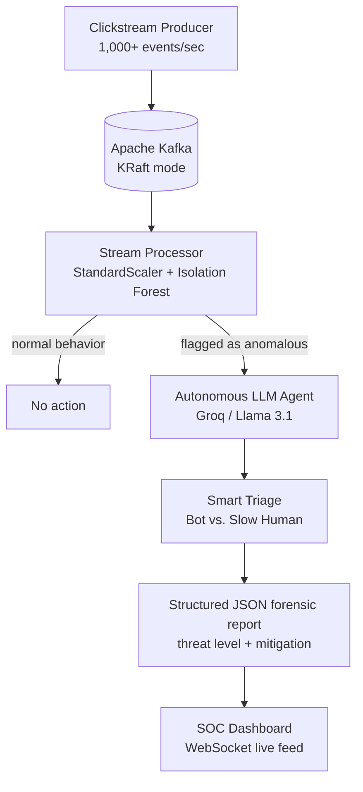

<div align="center">

# Anomaly Investigation Engine


> An event-driven streaming pipeline that scores live user behavior in milliseconds —
> and dispatches an autonomous AI investigator when something looks wrong.

</div>

<p align="center">
  
</p>

## Overview

The **Anomaly Investigation Engine** is an event-driven streaming pipeline that
monitors live user behavior to detect fraud, bots, and system glitches in
milliseconds.

Unlike traditional batch-processing models that analyze "yesterday's data,"
this system ingests live clickstream data via Apache Kafka, scores it using an
unsupervised machine learning model (Isolation Forest) in real time, and
triggers an **Autonomous LLM Agent** to investigate flagged anomalies, generate
forensic reports, and recommend mitigation actions.

The entire stack — Kafka, the ML scoring service, the AI agent, and the API —
spins up with a single `docker-compose up` command and runs locally.

## The Problem

| Aspect | Traditional batch monitoring | This engine |
| --- | --- | --- |
| When you find out | Tomorrow's report on yesterday's data | Milliseconds after the event occurs |
| Training data | Labeled fraud examples, expensive to collect | Unsupervised — the model learns "normal" from the live stream itself |
| Triage | An analyst wades through every alert | An LLM agent investigates each flag and returns a structured report |
| Delivery | Static dashboards, manual refresh | A WebSocket SOC feed — reports appear as they happen |

By the time a batch job has run, the fraudulent session is already over.
Detection only matters if it happens while the event is still happening —
and judgment only matters if it arrives with the detection, not hours later.
This engine pairs the two: a fast statistical detector that never sleeps,
and an AI investigator that explains what it found.

## Key Features

| Feature | What it does |
| --- | --- |
| Real-time streaming | Simulates 1,000+ live user events per second using Apache Kafka (KRaft mode) |
| Unsupervised ML detection | Uses scikit-learn's Isolation Forest to profile user behavior and assign real-time anomaly scores without labeled data |
| Autonomous AI investigator | When an anomaly is flagged, an LLM agent (Groq / Llama 3.1) is triggered. It analyzes the payload, determines the threat level (Bot vs. Slow Human), and generates a structured JSON forensic report |
| Live SOC dashboard | A dark-themed, WebSocket-powered FastAPI frontend where AI forensic reports pop up in real time |
| Fully containerized | The entire stack (Kafka, ML model, AI agent, API) spins up with a single `docker-compose up` command |

## Quick Start

After completing [Setup and Installation](#setup-and-installation):

```bash
docker-compose up -d --build
```

Wait 2-3 minutes for the ML baseline to train, then open
`http://localhost:8000` and watch the forensic reports arrive live.

## Table of Contents

- [Overview](#overview)
- [The Problem](#the-problem)
- [Key Features](#key-features)
- [How It Works: The Detection Pipeline](#how-it-works-the-detection-pipeline)
- [Architecture](#architecture)
- [The AI Investigator](#the-ai-investigator)
- [Tech Stack](#tech-stack)
- [Setup and Installation](#setup-and-installation)
- [Usage](#usage)
- [Engineering Challenges and Solutions](#engineering-challenges-and-solutions)
- [Limitations and Scope](#limitations-and-scope)
- [Roadmap](#roadmap)
- [Contributing](#contributing)
- [License](#license)

## How It Works: The Detection Pipeline

Every event flows through six stages:

1. **Ingest** — A simulated clickstream producer publishes 1,000+ user events
   per second into Kafka (KRaft mode, no Zookeeper).
2. **Learn the baseline** — The first ~200 events train the Isolation Forest.
   No labels, no supervised examples: the model profiles what "normal"
   behavior looks like from the stream itself.
3. **Score** — Every subsequent event is normalized with StandardScaler and
   assigned an anomaly score in milliseconds as it streams through.
4. **Flag** — Events whose behavior deviates from the baseline trigger the
   autonomous investigator instead of passing through silently.
5. **Investigate** — The LLM agent (LangChain tool calling) reads the flagged
   payload and performs smart triage: a burst of 5ms actions is a bot; a
   2,500ms action is just a slow human. It classifies the threat and drafts a
   structured JSON forensic report.
6. **Broadcast** — The report streams to the live SOC dashboard over
   WebSockets, appearing alongside the event stream as it happens.



The ordering is deliberate: the statistical detector runs on every event
because it is cheap and fast, and the LLM agent runs only on flagged events —
so the expensive reasoning layer is spent exactly where it adds judgment.

## Architecture


The diagram above shows the full data flow. In brief:

| Component | Role |
| --- | --- |
| Clickstream producer | Generates 1,000+ simulated user events per second |
| Apache Kafka (KRaft mode) | The streaming backbone carrying every event; no Zookeeper required |
| ML scoring service | StandardScaler normalization plus Isolation Forest anomaly scoring in real time |
| Autonomous LLM agent | LangChain-based investigator invoked on flagged anomalies |
| FastAPI + WebSockets | Serves the dark-themed SOC dashboard and pushes forensic reports live |
| Docker Compose | One command to start the whole stack |

## The AI Investigator

The Isolation Forest is fast but crude: it says "this event is unusual" and
nothing more. The LLM agent adds the judgment layer — it examines the flagged
payload, separates true positives from false ones, and writes up its findings
in a structured format a human operator (or a downstream system) can act on.

The key triage distinction the agent makes:

- **Bot** — sub-10ms processing times on rapid sequential actions. Impossible
  for a human. Threat level: high.
- **Slow Human** — long processing times (e.g., 2,500ms) that the raw model
  initially flagged, but which are perfectly normal human hesitation. Threat
  level: low.

Abridged and illustrative — exact wording varies by event and run:

```json
{
  "classification": "Bot",
  "threat_level": "HIGH",
  "evidence": {
    "processing_time_ms": 5,
    "action_code": 4,
    "pattern": "Rapid sequential actions at inhuman speed"
  },
  "assessment": "Event shows sub-10ms processing times across consecutive
    actions, far below the observed human baseline.",
  "recommended_mitigation": "Throttle the session and flag the source for
    rate limiting."
}
```

## Tech Stack

| Layer | Technology |
| --- | --- |
| Streaming broker | Apache Kafka (KRaft mode, no Zookeeper) |
| Machine learning | scikit-learn (Isolation Forest, StandardScaler) |
| AI agent framework | LangChain (tool calling, JSON parsing) |
| LLM provider | Groq (Llama 3.1 8B Instant) |
| Backend / API | FastAPI with WebSockets |
| Containerization | Docker and Docker Compose |

The agent talks to the LLM through the standard OpenAI-compatible interface,
so the provider is swappable — any OpenAI-compatible endpoint works, though
Groq is recommended for its speed.

## Setup and Installation

### 1. Clone the Repository

```bash
git clone https://github.com/sam-k99/anomaly-engine.git
cd anomaly-engine
```

### 2. Set Environment Variables

Create a `.env` file in the root directory and add your Groq API key:

```env
GROQ_API_KEY=gsk_your_groq_api_key_here
```

Any OpenAI-compatible LLM works here; Groq is recommended for its speed.

### 3. Spin Up the Infrastructure

Ensure Docker and Docker Compose are installed, then run:

```bash
docker-compose up -d --build
```

Note: the ML model requires 200 events to train its baseline. It will take
about 2-3 minutes after starting for the first anomalies to appear on the
dashboard.

### 4. View the Live Dashboard

Open your browser and go to `http://localhost:8000` to watch the AI SOC
reports pop up in real time.

## Usage

### What to Expect, Minute by Minute

1. All containers start; the producer begins emitting simulated clickstream
   events into Kafka.
2. For the first ~200 events, the Isolation Forest is training its baseline —
   no anomalies are reported during this window.
3. Roughly 2-3 minutes in, scoring goes live: flagged events begin triggering
   the LLM agent.
4. Forensic reports start appearing on the dashboard in real time, pushed over
   WebSockets as each investigation completes.

### Watching the System Work

Confirm all containers are running:

```bash
docker ps
```

Follow the logs of every service at once — the best way to watch events flow,
scores compute, and investigations trigger:

```bash
docker-compose logs -f
```

Then open `http://localhost:8000` and let the dashboard tell the story.

## Engineering Challenges and Solutions

**Docker Compose race conditions.** The Python pipeline started before Kafka
was fully ready to accept connections, causing `Connection refused` errors.
Fixed with a Docker `healthcheck` on the Kafka container: the pipeline uses
`depends_on: condition: service_healthy` and waits until Kafka's port 9092 is
actively accepting TCP connections before booting.

**Feature-scale bias in detection.** The Isolation Forest was flagging "slow
humans" as anomalies because the feature `processing_time_ms` (0-3000)
heavily outweighed `action_code` (1-6). Fixed two ways: `StandardScaler`
normalizes the feature space so velocity and action type weigh equally, and
the LLM agent was introduced as a "Smart Triage" layer to distinguish true
bot anomalies (5ms) from false positive human anomalies (2500ms).

**Kafka listeners inside Docker.** Kafka containers cannot use `localhost`
for inter-container communication. Fixed by configuring
`KAFKA_ADVERTISED_LISTENERS` to the Docker service name `kafka:9092` and
updating all Python consumers to dynamically resolve the broker via
environment variables.

## Limitations and Scope

This is a demonstration of the pattern, and it is honest about being one:

- Traffic is simulated by the bundled producer, not real users.
- The model profiles a small behavioral feature space (action type, processing
  time); richer session features would improve precision.
- Detection starts only after the ~200-event warm-up window.
- A single Kafka broker with no replication — no high availability.
- Findings surface on the dashboard only; there is no alert routing yet.
- Every flagged anomaly triggers an LLM call, so investigation volume has a
  cost.

## Roadmap

- Pluggable detectors (autoencoders, online learning) behind the same
  streaming interface
- Richer feature engineering: sessionization, geo/IP velocity, device signals
- Alert routing to Slack, email, and PagerDuty
- A human feedback loop that sharpens the agent's triage over time
- Multi-broker Kafka with replication for production-grade availability
- Model drift monitoring with automated baseline retraining

## Contributing

Pull requests are welcome. If you change the detector, the feature space, or
the agent's triage logic, include before-and-after examples of the forensic
reports so reviewers can see the effect on classification quality.


<div align="center">

Thanks for stopping by 

</div>
